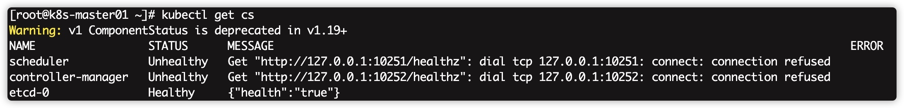

# 使用kubeadm部署单节点Kubernetes

id: kubeadm-install-k8s
categories: docker, k8s, container, cloudnative
tags: kubernetes
status: Published 
authors: balladpanda
Feedback Link: https://debris.cn

## 环境准备
确保每个节点上 MAC 地址和 product_uuid 的唯一性
- 你可以使用命令 `ip link` 或 `ifconfig -a` 来获取网络接口的 MAC 地址
- 可以使用 `sudo cat /sys/class/dmi/id/product_uuid` 命令对 product_uuid 校验

一般来讲，硬件设备会拥有唯一的地址，但是有些虚拟机的地址可能会重复。 Kubernetes使用这些值来唯一确定集群中的节点。 如果这些值在每个节点上不唯一，可能会导致安装失败。

### 服务器信息


|    IP地址    |       角色       | CPU  | 内存 | 主机名（hostname） |
| :----------: | :--------------: | :--: | :--: | :----------------: |
| 172.16.2.246 | master and  etcd |  4   |  8   |    k8s-master01    |
| 172.16.2.247 |    work node     |  4   |  8   |     k8s-work01     |


### 软件版本


|    操作系统    | 系统内核版本 | Kubernetes版本 | docker版本 | kubectl版本 | kubeadm版本 | kubelet版本 |
| :------------: | :----------: | :------------: | :--------: | ----------- | :---------: | :---------: |
| CentOS7.9.2009 |    5.10.7    |     1.19.7     |  19.03.9   | 1.19.7      |   1.19.7    |   1.19.7    |


Negative
: 注意：这里采用的软件版本，请大家严格保持一致！开源软件，版本非常敏感和重要！
kubernetes版本要求参考地址：</br>
https://github.com/kubernetes/kubernetes/tree/master/CHANGELOG
https://kubernetes.io/docs/setup/release/version-skew-policy/


### 环境初始化操作

#### 配置hostname

根据服务器实际名称替换`$master`、`$node`的值

```
hostnamectl set-hostname $master
hostnamectl set-hostname $node
```


Negative
: 注意：hostname不能有大写字母，还有其他的特殊符号，也不要有`_`，否则后面初始化会报错。


#### 配置/etc/hosts
注意，hosts文件非常重要
修改配置文件

```
vi /etc/hosts
```
添加以下内容
```
172.16.2.246 k8s-master01
172.16.2.247 k8s-work01
```

#### 关闭防火墙

```
systemctl stop firewalld
systemctl disable firewalld
```

#### 关闭swap分区

```
swapoff -a
sed -i 's/.*swap.*/#&/' /etc/fstab
```

#### 关闭selinux

```
setenforce  0
sed -i "s/^SELINUX=enforcing/SELINUX=disabled/g" /etc/sysconfig/selinux
sed -i "s/^SELINUX=enforcing/SELINUX=disabled/g" /etc/selinux/config
sed -i "s/^SELINUX=permissive/SELINUX=disabled/g" /etc/sysconfig/selinux
sed -i "s/^SELINUX=permissive/SELINUX=disabled/g" /etc/selinux/config  
```

#### 加载br_netfilter

```
modprobe br_netfilter
```
或者
```
cat <<EOF | sudo tee /etc/modules-load.d/k8s.conf
br_netfilter
EOF
```
#### 配置内核参数

```
cat > /etc/sysctl.d/k8s.conf <<EOF
net.ipv4.ip_forward = 1
net.bridge.bridge-nf-call-ip6tables = 1
net.bridge.bridge-nf-call-iptables = 1
EOF
```

#### 生效内核配置文件

```
sysctl -p /etc/sysctl.d/k8s.conf

```

#### 修改Linux资源配置文件，调高`ulimit`最大打开数和systemctl管理的服务文件最大打开数

```
echo "* soft nofile 655360" >> /etc/security/limits.conf
echo "* hard nofile 655360" >> /etc/security/limits.conf
echo "* soft nproc 655360"  >> /etc/security/limits.conf
echo "* hard nproc 655360"  >> /etc/security/limits.conf
echo "* soft  memlock  unlimited"  >> /etc/security/limits.conf
echo "* hard memlock  unlimited"  >> /etc/security/limits.conf
echo "DefaultLimitNOFILE=1024000"  >> /etc/systemd/system.conf 
echo "DefaultLimitNPROC=1024000"  >> /etc/systemd/system.conf
```

#### 配置k8s介质yum源

```
cat <<EOF > /etc/yum.repos.d/kubernetes.repo
[kubernetes]
name=Kubernetes
baseurl=https://mirrors.aliyun.com/kubernetes/yum/repos/kubernetes-el7-x86_64/
enabled=1
gpgcheck=1
repo_gpgcheck=1
gpgkey=https://mirrors.aliyun.com/kubernetes/yum/doc/yum-key.gpg https://mirrors.aliyun.com/kubernetes/yum/doc/rpm-package-key.gpg
EOF
```

#### 安装依赖软件包

```
yum install  -y conntrack ipvsadm ipset jq sysstat curl iptables libseccomp bash-completion yum-utils device-mapper-persistent-data lvm2 net-tools conntrack-tools vim libtool-ltdl
```

#### 时间同步配置

Kubernetes是分布式的，各个节点系统时间需要同步对应上。

```
yum install chrony –y
systemctl enable chronyd.service && systemctl start chronyd.service && systemctl status chronyd.service
chronyc sources
```

#### 配置节点间ssh互信

配置ssh互信，那么节点之间就能无密访问，方便日后执行自动化部署.
每台机器执行这个命令，一路回车即可

```
ssh-keygen 
```

将master上的公钥拷贝到其他节点，替换`node`名称,这里需要同意输入yes和密码    

```
ssh-copy-id  $node      
```

#### 初始化环境配置检查

- 重启，做完以上所有操作，最好reboot重启一遍
- ping 每个节点hostname 看是否能ping通
- ssh 对方hostname看互信是否无密码访问成功
- 执行date命令查看每个节点时间是否正确
- 执行 ulimit -Hn 看下最大文件打开数是否是655360
- cat /etc/sysconfig/selinux |grep disabled 查看下每个节点selinux是否都是disabled状态

## docker安装

参考：[docker安装](https://gosre.io/codelabs/Container-install)

## 安装kubeadm等工具

这一步是所有节点都得安装（包括node节点），可以
工具说明：
- kubeadm: 部署集群用的命令
- kubelet: 在集群中每台机器上都要运行的组件，负责管理pod、容器的生命周期
- kubectl: 集群管理工具

### 安装工具
查询kube系列工具的版本号
```
yum list kubeadm --showduplicates | sort -r
```
安装kube系列工具
``` 
yum install -y kubelet-1.19.7 kubeadm-1.19.7 kubectl-1.19.7 --disableexcludes=kubernetes
```

### 启动kubelet

```
systemctl enable kubelet && systemctl start kubelet
systemctl enable --now kubelet
```

Negative
: 提示：此时kubelet的服务运行状态是异常的，因为缺少主配置文件kubelet.conf。但可以暂不处理，因为在完成Master节点的初始化后才会生成这个配置文件。


## 镜像下载准备
### 查询镜像列表

```
kubeadm config  images list
```

### 生成默认`kubeadm.conf`文件

```
kubeadm config print init-defaults > kubeadm.conf      
```

### 绕过墙下载镜像方法（注意认真看，后期版本安装也可以套用这方法）
注意这个配置文件默认会从google的镜像仓库地址k8s.gcr.io下载镜像，如果你没有科学上网，那么就会下载不来。因此，我们通过下面的方法把地址改成国内的，比如用阿里的。

替换镜像仓库地址
```
sed -i 's!imageRepository: k8s.gcr.io!imageRepository: registry.aliyuncs.com/google_containers!g' kubeadm.conf
```

替换版本号
```
sed -i "s/kubernetesVersion: .*/kubernetesVersion: v1.19.7/g" kubeadm.conf
```
下载镜像

```
kubeadm config images pull --config kubeadm.conf
```
修改镜像前缀脚本
通过脚本将`registry.aliyuncs.com`开头的镜像重命名为`k8s.gcr.io`，或者手动通过`docker tag`命令。这样安装程序才能识别到。

```
vi image-rename.sh
```

添加以下内容

```
#!/bin/bash
images=(kube-apiserver:v1.19.7 kube-controller-manager:v1.19.7 kube-scheduler:v1.19.7 kube-proxy:v1.19.7
pause:3.2 etcd:3.4.13-0 coredns:1.7.0)
for imageName in ${images[@]} ; do
  docker tag registry.aliyuncs.com/google_containers/$imageName k8s.gcr.io/$imageName
  docker rmi registry.aliyuncs.com/google_containers/$imageName
done
```

检查镜像

```
docker image ls 
```

## 部署master节点
### `kubeadm init `初始化master节点

```
kubeadm init --kubernetes-version=v1.19.7 --pod-network-cidr=192.168.0.0/16 --apiserver-advertise-address=172.16.2.246
```

Positive
: 这里我们定义POD的网段为: 192.168.0.0/16 ,然后api server地址就是master本机IP地址。

初始化成功后，/etc/kubernetes/ 会生成下面文件,同时最后会生成一句话,这个我们记录下,到时候添加node的时候要用到。

```
kubeadm join 172.16.2.246:6443 --token osvv1g.7hlo28nnvgdcodiu \
    --discovery-token-ca-cert-hash sha256:a19172e1f2e029b742a8c74391522fc241fde587f511e098abd17aad39c95176
```


### 验证测试
配置kubectl命令

```
mkdir -p /root/.kube
cp /etc/kubernetes/admin.conf /root/.kube/config
```

执行获取pods列表命令，查看相关状态

```
kubectl get pods --all-namespaces
```

在安装网络之前,集群`DNS (CoreDNS)`将不会启动,处于Pending状态，这个先不管。
我们可以执行` kubectl get cs`查看集群的健康状态，会看到集群有`unhealthy`的状态，出现这种情况是kube-controller-manager.yaml和kube-scheduler.yaml设置的默认端口是0，在文件中注释掉就可以了。（每台master节点都要执行操作）


### 修改kube-scheduler.yaml文件,注释`port=0`所在行
`vim /etc/kubernetes/manifests/kube-scheduler.yaml`
参考内容如下:
```
apiVersion: v1
kind: Pod
metadata:
  creationTimestamp: null
  labels:
    component: kube-scheduler
    tier: control-plane
  name: kube-scheduler
  namespace: kube-system
spec:
  containers:
  - command:
    - kube-scheduler
    - --authentication-kubeconfig=/etc/kubernetes/scheduler.conf
    - --authorization-kubeconfig=/etc/kubernetes/scheduler.conf
    - --bind-address=127.0.0.1
    - --kubeconfig=/etc/kubernetes/scheduler.conf
    - --leader-elect=true
#    - --port=0
    image: k8s.gcr.io/kube-scheduler:v1.19.7
    imagePullPolicy: IfNotPresent
    livenessProbe:
      failureThreshold: 8
      httpGet:
        host: 127.0.0.1
        path: /healthz
        port: 10259
        scheme: HTTPS
      initialDelaySeconds: 10
      略...
```


### 修改kube-controller-manager.yaml文件，注释`port=0`所在行
`vim /etc/kubernetes/manifests/kube-controller-manager.yaml`
参考内容如下:
```
apiVersion: v1
kind: Pod
metadata:
  creationTimestamp: null
  labels:
    component: kube-controller-manager
    tier: control-plane
  name: kube-controller-manager
  namespace: kube-system
spec:
  containers:
  - command:
    - kube-controller-manager
    - --allocate-node-cidrs=true
    - --authentication-kubeconfig=/etc/kubernetes/controller-manager.conf
    - --authorization-kubeconfig=/etc/kubernetes/controller-manager.conf
    - --bind-address=127.0.0.1
    - --client-ca-file=/etc/kubernetes/pki/ca.crt
    - --cluster-cidr=192.168.10.0/24
    - --cluster-name=kubernetes
    - --cluster-signing-cert-file=/etc/kubernetes/pki/ca.crt
    - --cluster-signing-key-file=/etc/kubernetes/pki/ca.key
    - --controllers=*,bootstrapsigner,tokencleaner
    - --kubeconfig=/etc/kubernetes/controller-manager.conf
    - --leader-elect=true
    - --node-cidr-mask-size=24
#    - --port=0
    - --requestheader-client-ca-file=/etc/kubernetes/pki/front-proxy-ca.crt
    - --root-ca-file=/etc/kubernetes/pki/ca.crt
    - --service-account-private-key-file=/etc/kubernetes/pki/sa.key
    - --service-cluster-ip-range=10.96.0.0/12
    - --use-service-account-credentials=true
    image: k8s.gcr.io/kube-controller-manager:v1.19.7
    imagePullPolicy: IfNotPresent
    livenessProbe:
      failureThreshold: 8
      httpGet:
        host: 127.0.0.1
        path: /healthz
        port: 10257
        scheme: HTTPS
      initialDelaySeconds: 10
      periodSeconds: 10
      略...
```

每台master重启kubelet

```
systemctl restart kubelet
```
再次查看状态

```
kubectl get cs
```


## 部署网络插件
网络插件现在有`flannel`、`calico`等,我们此次采用`Flannel`

Negative
: calico有2种中作模式: ipip(隧道方案)、bgp(路由方案),所以公有云可能会对路由方案造成影响,并且有的云主机会禁止路由(bgp)方案,所以有些云厂商是禁止此实现方式的,因为他会写入路由表,这样可能会影响到厂商现有网络,这个需到你自己的环境实测才能百分百确认。


### 安装`Flannel`
```
kubectl apply -f https://raw.githubusercontent.com/coreos/flannel/master/Documentation/kube-flannel.yml
```
### 检查状态

```
kubectl get pods --all-namespaces
```

## 部署node节点
前置条件:已经安装容器以及系统配置调整
参考master节点下载镜像的方法，下载node需要的镜像，避免因网络因素下载不了镜像
下载镜像:
```
docker pull registry.aliyuncs.com/google_containers/kube-proxy:v1.19.7
docker pull registry.aliyuncs.com/google_containers/pause:3.2
docker pull quay.io/coreos/flannel:v0.14.0 
```
重命名镜像:
```
docker tag registry.aliyuncs.com/google_containers/kube-proxy:vv1.19.7 k8s.gcr.io/kube-proxy:vv1.19.7
docker tag registry.aliyuncs.com/google_containers/pause:3.2 k8s.gcr.io/pause:3.2
```
加入集群（master节点复制命令）
```
kubeadm join 172.16.2.245:6443 --token iele66.4yfkoclhem70fhq2 \
        --discovery-token-ca-cert-hash sha256:9e0a9d3118ed41465b7321f3d3e0fba99e6dbd3c372164fab3398c004febe62a
```
## 检查状态
在master节点执行
```
kubectl get nodes
kubectl get pods -n kube-system -o wide
```
## 部署Dashboard（一）
Dashboard 2.0之后的版本，只允许用https访问，Chrome浏览器不允许没有证书的网站使用https访问，所以这次我们采用配置自签证书。
### 配置自签证书
#### 生成私钥和证书签名请求
(这里crt、key的文件名一定要叫dashboard,不然证书会无效)
```
mkdir -p /etc/kubernetes/certs 
cd  /etc/kubernetes/certs
openssl genrsa -des3 -passout pass:x -out dashboard.pass.key 2048
openssl rsa -passin pass:x -in dashboard.pass.key -out dashboard.key
```
#### 删除生成的dashboard.pass.key
```
rm -rf dashboard.pass.key
```
#### 生成dashboard.csr
```
openssl req -new -key dashboard.key -out dashboard.csr
```
#### 生成SSL证书
dashboard.crt文件是适用于仪表板和dashboard.key私钥的证书
```
openssl x509 -req -sha256 -days 365 -in dashboard.csr -signkey dashboard.key -out dashboard.crt
```
#### 创建secret
注意/etc/kubernetes/certs 是之前创建crt、csr、key 证书文件存放的路径
```
kubectl create secret generic kubernetes-dashboard-certs --from-file=/etc/kubernetes/certs -n kube-system
```
#### 查看secret
```
kubectl get secret kubernetes-dashboard-certs -n kubernetes-dashboard -o yaml
```
## 部署Dashboard(二)
根据k8s版本选择对应的daashboard版本，参考地址：https://github.com/kubernetes/dashboard/releases
### 下载yaml文件
```
wget https://raw.githubusercontent.com/kubernetes/dashboard/v2.3.1/aio/deploy/recommended.yaml
```
### 将名称空间修改为kube-system
为什么要修改，官方yaml默认会新建一个名为kubernetes-dashboard的空间，感觉没有必要，就跟kube-system放一起，参考其他文档的同学稍微注意下。
```
sed -i '/namespace/ s/kubernetes-dashboard/kube-system/g' recommended.yaml
```
Negative
: 注意：最后部署成功之后，因为有5种方式访问dashboard：我们这里使用Nodport方式访问
* Nodport方式访问dashboard，service类型改为NodePort
* loadbalacer方式，service类型改为loadbalacer
* Ingress方式访问dashboard
* API server方式访问 dashboard
* kubectl proxy方式访问dashboard

### 配置Nodport
修改yaml文件，将service改为NodePort
vim recommended.yaml
```
kind: Service
apiVersion: v1
metadata:
  labels:
    k8s-app: kubernetes-dashboard
  name: kubernetes-dashboard
  namespace: kube-system
spec:
  type: NodePort #增加内容
  ports:
    - port: 443
      targetPort: 8443
      nodePort: 30005 #增加内容
  selector:
    k8s-app: kubernetes-dashboard
```
### 部署应用
```
kubectl apply -f recommended.yaml
```
### 检查运行状态
```
kubectl get pod --namespace=kube-system -o wide | grep dashboard
ss -ntl|grep 30005
```
通过浏览器访问：https://master:31620

因为我的应用运行在master上，又是NodePort方式，所以直接访问master的地址
### 配置登录令牌
官方参考文档：
https://github.com/kubernetes/dashboard/blob/master/docs/user/access-control/creating-sample-user.md
#### 创建dashboard-adminuser.yaml
vim dashboard-adminuser.yaml
```
---
apiVersion: v1
kind: ServiceAccount
metadata:
  name: admin-user
  namespace: kube-system
---
apiVersion: rbac.authorization.k8s.io/v1
kind: ClusterRoleBinding
metadata:
  name: admin-user
roleRef:
  apiGroup: rbac.authorization.k8s.io
  kind: ClusterRole
  name: cluster-admin
subjects:
- kind: ServiceAccount
  name: admin-user
  namespace: kube-system
```
#### 新建管理员权限用户
```
kubectl create -f dashboard-adminuser.yaml
serviceaccount/admin-user created
```
#### 获取token
```
kubectl -n kube-system get secret $(kubectl -n kube-system  get sa/admin-user -o jsonpath="{.secrets[0].name}") -o go-template="{{.data.token | base64decode}}"
```
复制令牌并将其粘贴到登录屏幕上的输入令牌字段中。